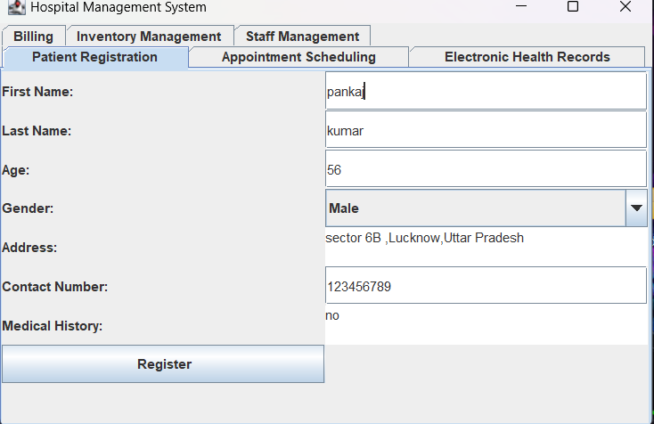
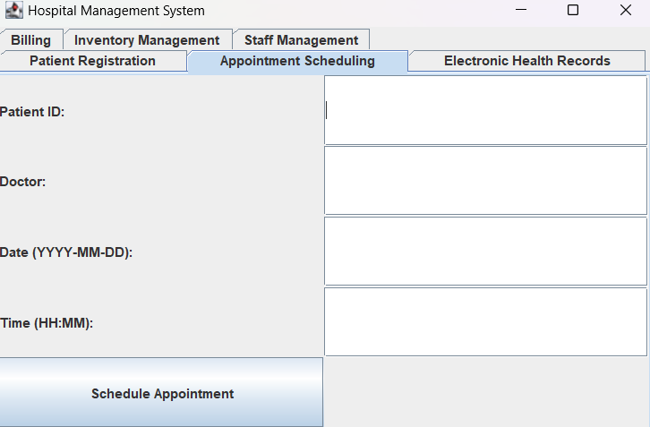
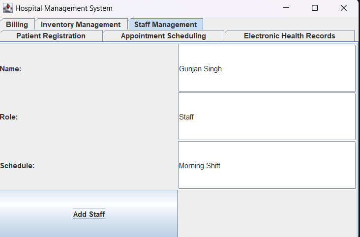

# Hospital Management System

## Overview

The Hospital Management System is a comprehensive Java-based application designed to streamline various administrative and clinical operations within a hospital setting. This project encompasses modules for patient registration, appointment scheduling, electronic health records (EHR), billing, inventory management, and staff management.

## Features

1. **Patient Registration**
   - Register new patients with their personal and medical details.
   - Update existing patient information.
   - Secure storage of patient data with easy retrieval.

2. **Appointment Scheduling**
   - Schedule, reschedule, and cancel patient appointments.
   - View appointment history and upcoming appointments.
   - Automated reminders for scheduled appointments.

3. **Electronic Health Records (EHR)**
   - Maintain detailed electronic health records for each patient.
   - Record patient visits, diagnoses, treatments, and prescriptions.
   - Secure access to EHRs for authorized personnel only.

4. **Billing and Invoicing**
   - Generate and manage invoices for patient services.
   - Process payments and track outstanding balances.
   - Comprehensive billing reports for administrative review.

5. **Medical Supply Inventory Management**
   - Track inventory levels for medical supplies and equipment.
   - Set up alerts for low-stock items.
   - Generate inventory reports for restocking and auditing.

6. **Staff Management**
   - Manage staff information, including roles and schedules.
   - Assign tasks and shifts to staff members.
   - Monitor staff attendance and performance.

## Technologies Used

- **Java**: Core programming language for implementing business logic.
- **Java Swing**: Used for building the graphical user interface (GUI).
- **JDBC (Java Database Connectivity)**: For database connectivity and operations.
- **SQL**: Database management for storing and retrieving data.
- **Java Collections Framework**: Utilized for efficient data management and manipulation.

## Installation

1. **Clone the Repository**
   https://github.com/pankajk12/VilearnX-Task-3

2. **Set Up the Database**
   - Ensure that you have an SQL database installed and running.
   - Create the necessary tables by executing the provided SQL scripts in the `/database` directory.

3. **Compile and Run**
   - Compile the Java code using your preferred IDE or command line.
   - Run the application and connect it to the database using the JDBC configurations.

## Screenshots

Here are some screenshots of the application:

### Patient Registration Module

### Appointment Scheduling Module

### Staff Management Module

## Usage

- **Patient Registration**: Navigate to the "Patient" module to add or update patient information.
- **Appointment Scheduling**: Use the "Appointments" module to manage patient appointments.
- **EHR Management**: Access the "Health Records" module to view and update patient health records.
- **Billing**: Go to the "Billing" section to generate and manage invoices.
- **Inventory**: Monitor and manage medical supplies under the "Inventory" module.
- **Staff**: Manage staff information and schedules in the "Staff" section.

## Contributing

Contributions are welcome! Please fork the repository and create a pull request with your changes. Ensure that your code follows the project's coding standards and includes appropriate documentation.

## License

This project is licensed under the MIT License - see the [LICENSE](LICENSE) file for details.

# Author
* Pankaj Kumar -https://github.com/pankajk12
